<!-- ═══════════════════════════════════════════════════════════════
     PROFILE CONFIGURATION — Update the values below as needed
     ═══════════════════════════════════════════════════════════════ -->
<!-- LINKEDIN_URL  = https://linkedin.com/in/your-profile -->
<!-- RESUME_URL    = https://your-resume-url.com -->
<!-- EMAIL         = alessandro.chaves@email.com -->
<!-- ═══════════════════════════════════════════════════════════════ -->



---

## Introduction

Senior Oracle Technical Consultant with over 20 years of experience designing, building, and optimizing enterprise-grade database and ERP solutions.

I specialize in Oracle Database, PL/SQL, and E-Business Suite — with a strong focus on data migration, system integration, and SQL performance tuning across on-premises and cloud environments.

Committed to software quality, clean architecture, and continuous improvement. Currently expanding into Python, modern engineering practices, and cloud-native automation.

---

## Core Expertise

| | | |
|:---|:---|:---|
| **Oracle Database** | **PL/SQL** | **Oracle EBS** |
| **Oracle Cloud** | **Data Migration** | **ERP Integration** |
| **Performance Tuning** | **Software Architecture** | **System Integration** |

---

## Currently Learning

```
Python  ·  Oracle APEX  ·  Clean Architecture  ·  Design Patterns
Testing  ·  REST APIs  ·  DevOps
```

Expanding beyond traditional Oracle consulting into modern software engineering — applying architectural discipline, testability, and automation to enterprise solutions.

---

## Technology Stack

<p align="left">
  
  
  
  
  
  
  
</p>

<p align="left">
  
</p>

---

## GitHub Statistics

<p align="center">
  

  
</p>

---

## Featured Projects

> These projects are currently in development and will be published soon.

<table>
  <tr>
    <td width="50%" valign="top">
      <h3>GitHub Admin Toolkit</h3>
      <p>Automation utilities for repository management, workflows, and administrative tasks on GitHub.</p>
      <code>Coming soon</code>
    </td>
    <td width="50%" valign="top">
      <h3>Oracle Data Migration Framework</h3>
      <p>Structured framework for planning, executing, and validating large-scale Oracle data migrations.</p>
      <code>Coming soon</code>
    </td>
  </tr>
  <tr>
    <td width="50%" valign="top">
      <h3>PL/SQL Best Practices</h3>
      <p>Reference patterns and guidelines for writing maintainable, performant PL/SQL code.</p>
      <code>Coming soon</code>
    </td>
    <td width="50%" valign="top">
      <h3>Oracle Performance Lab</h3>
      <p>Diagnostic scripts and methodologies for SQL tuning and database performance analysis.</p>
      <code>Coming soon</code>
    </td>
  </tr>
  <tr>
    <td width="50%" valign="top">
      <h3>Oracle APEX Gym Tracker</h3>
      <p>Full-stack fitness tracking application built with Oracle APEX and modern web practices.</p>
      <code>Coming soon</code>
    </td>
    <td width="50%" valign="top">
      <h3>Python ETL Toolkit</h3>
      <p>Lightweight Python toolkit for data extraction, transformation, and loading pipelines.</p>
      <code>Coming soon</code>
    </td>
  </tr>
</table>

---

## Professional Philosophy

> *"I believe great software is built through simplicity, maintainability, collaboration, and continuous learning."*

| Principle | Principle |
|:---|:---|
| ✔ Clean Code | ✔ Simplicity |
| ✔ Readability | ✔ Documentation |
| ✔ Performance | ✔ Automation |
| ✔ Continuous Learning | |

---

## Contact

<p align="left">
  <a href="https://github.com/aschaves1976">
    
  </a>
  <a href="https://www.linkedin.com/in/alessandro-chaves1976rj/">
    
  </a>
  <a href="https://your-resume-url.com">
    
  </a>
  <a href="mailto:alessandro.chaves@email.com">
    
  </a>
</p>

---

<sub>Oracle Technical Consultant · Enterprise Solutions · Continuous Learning</sub>
